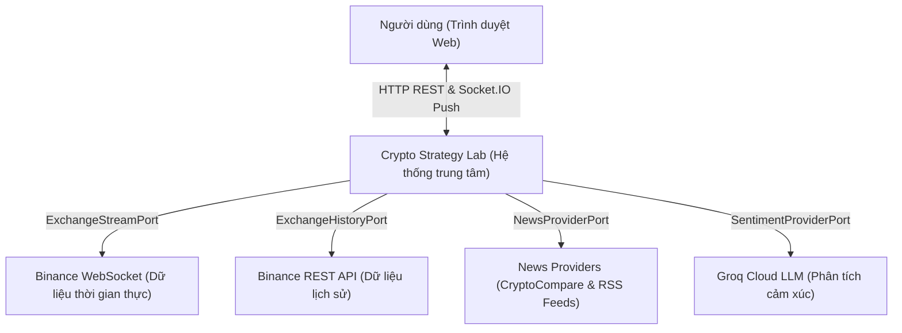
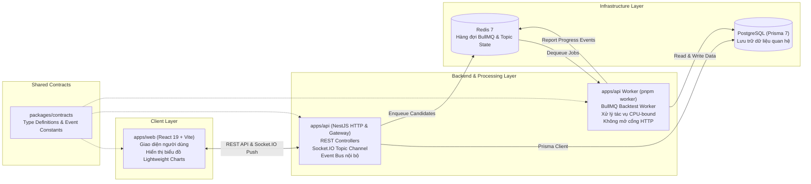
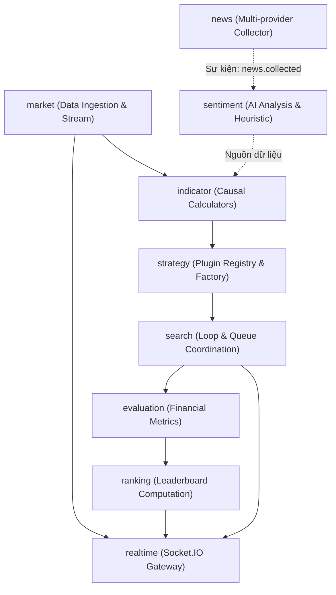
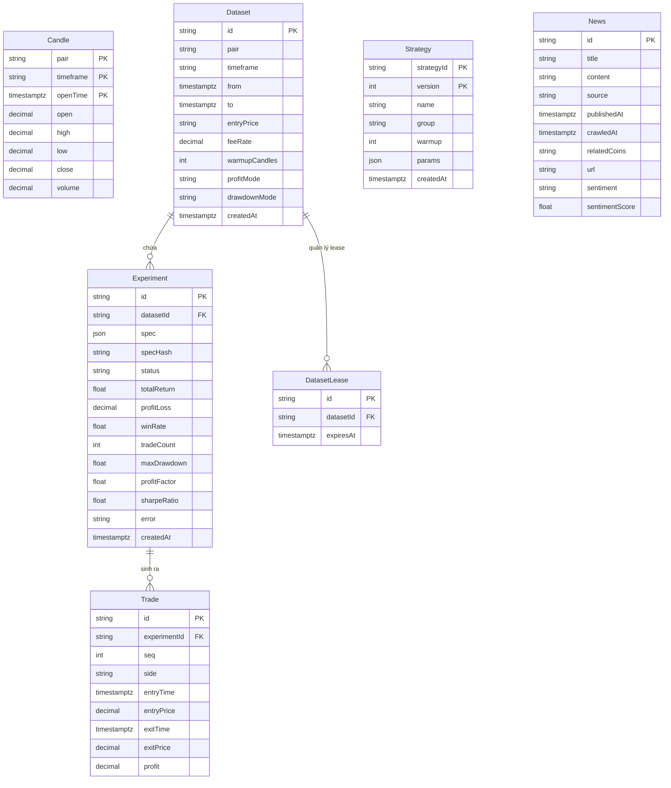
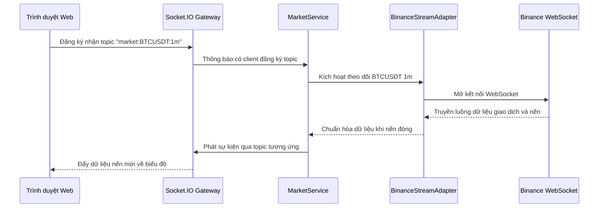
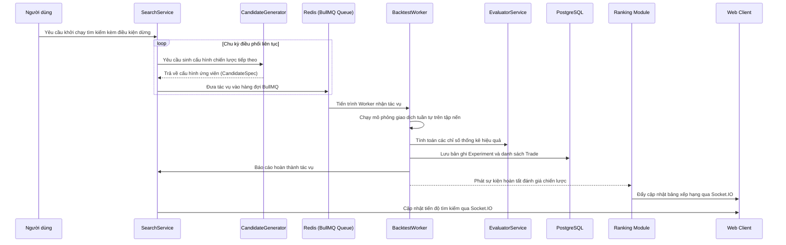

# BÁO CÁO TỔNG QUAN ĐỒ ÁN CUỐI KỲ

# MÔN HỌC: KIẾN TRÚC PHẦN MỀM

---

## ĐỀ TÀI: CRYPTO STRATEGY LAB

### NỀN TẢNG PHÂN TÍCH, KẾT HỢP VÀ TỰ ĐỘNG ĐÁNH GIÁ CHIẾN LƯỢC GIAO DỊCH CRYPTO

- **Nhóm thực hiện:** Nhóm 11
- **Lớp:** 23KTPM1 — Khoa Công nghệ Thông tin, Trường Đại học Khoa học Tự nhiên, ĐHQG-HCM
- **Kho lưu trữ GitHub:** [https://github.com/dinosauce-285/Crypto-Strategy-Lab](https://github.com/dinosauce-285/Crypto-Strategy-Lab)
- **Thư mục Video Demo:** [Google Drive Folder](https://drive.google.com/drive/folders/1Hl4MeQ3PW8PfTxDYbKxcKRzCJCeYPPQ0?usp=sharing)
- **Thời gian hoàn thành:** 09/2026

---

## MỤC LỤC

1. [TỔNG QUAN HỆ THỐNG VÀ PHÂN CÔNG THỰC HIỆN](#1-tổng-quan-hệ-thống-và-phân-công-thực-hiện)
2. [BỐI CẢNH VÀ CÁC NGUYÊN TẮC THIẾT KẾ KIẾN TRÚC](#2-bối-cảnh-và-các-nguyên-tắc-thiết-kế-kiến-trúc)
3. [THIẾT KẾ KIẾN TRÚC TOÀN DIỆN (SYSTEM ARCHITECTURE)](#3-thiết-kế-kiến-trúc-toàn-diện-system-architecture)
   - 3.1. [Ngữ cảnh hệ thống (System Context)](#31-ngữ-cảnh-hệ-thống-system-context)
   - 3.2. [Phân rã Container và Tiến trình (Container & Process Decomposition)](#32-phân-rã-container-và-tiến-trình-container--process-decomposition)
   - 3.3. [Phân rã Module và Trách nhiệm (Module Decomposition)](#33-phân-rã-module-và-trách-nhiệm-module-decomposition)
   - 3.4. [Kiến trúc Dữ liệu và Cơ chế Lưu trữ (Data Architecture & Database Schema)](#34-kiến-trúc-dữ-liệu-và-cơ-chế-lưu-trữ-data-architecture--database-schema)
   - 3.5. [Các luồng xử lý chính (Core Operational Flows)](#35-các-luồng-xử-lý-chính-core-operational-flows)
4. [KIỂM SOÁT VÀ PHÒNG TRÁNH CÁC ANTI-PATTERNS](#4-kiểm-soát-và-phòng-tránh-các-anti-patterns)
5. [ĐÁNH GIÁ HIỆN TRẠNG TRIỂN KHAI THEO CÁC TIÊU CHÍ KỸ THUẬT](#5-đánh-giá-hiện-trạng-triển-khai-theo-các-tiêu-chí-kỹ-thuật)
   - 5.1. [Nhóm A: Kiến trúc phần mềm](#51-nhóm-a-kiến-trúc-phần-mềm)
   - 5.2. [Nhóm B: Chức năng hệ thống](#52-nhóm-b-chức-năng-hệ-thống)
   - 5.3. [Nhóm C: Hồ sơ và Tài liệu](#53-nhóm-c-hồ-sơ-và-tài-liệu)
   - 5.4. [Nhóm D: Mức độ sẵn sàng và Xử lý lỗi](#54-nhóm-d-mức-độ-sẵn-sàng-và-xử-lý-lỗi)
   - 5.5. [Nhóm E: Mở rộng kiến trúc](#55-nhóm-e-mở-rộng-kiến-trúc)
6. [CÁC ĐẶC TÍNH MỞ RỘNG VÀ NÂNG CAO CỦA KIẾN TRÚC](#6-các-đặc-tính-mở-rộng-và-nâng-cao-của-kiến-trúc)
7. [KẾT LUẬN](#7-kết-luận)

---

## 1. TỔNG QUAN HỆ THỐNG VÀ PHÂN CÔNG THỰC HIỆN

Crypto Strategy Lab là nền tảng phần mềm phục vụ việc thử nghiệm, kết hợp và đánh giá tự động các chiến lược giao dịch tiền mã hóa trên dữ liệu lịch sử và thời gian thực. Hệ thống được phát triển theo mô hình monorepo, áp dụng các chuẩn mực của kiến trúc hướng module, kiến trúc lục giác (Ports and Adapters) và kiến trúc hướng sự kiện (Event-driven Architecture).

Dự án được thực hiện bởi Nhóm 11 gồm 5 thành viên với tỷ lệ đóng góp đồng đều (20% mỗi thành viên):

| STT |   MSSV   | Họ và tên             | Vai trò chính                                  | Tỷ lệ đóng góp | Công việc thực hiện                                                                                                                                                                                                                                                                                                                                                                                                 |
| :-: | :------: | :-------------------- | :--------------------------------------------- | :------------: | :------------------------------------------------------------------------------------------------------------------------------------------------------------------------------------------------------------------------------------------------------------------------------------------------------------------------------------------------------------------------------------------------------------------ |
|  1  | 23127219 | Ngô Bảo Long          | Strategy Engine & Search Architect             |      20%       | Xây dựng abstraction và interface cho Strategy, triển khai StrategyRegistry và các chiến lược phân tích kỹ thuật (MA, RSI, Bollinger Bands, Support/Resistance). Thiết kế module Composite Strategy và Strategy Search Engine (Random Search, Domain-guided Search). Xây dựng giao diện điều khiển tìm kiếm và xử lý tính an toàn của Dataset trong quá trình backtest.                                             |
|  2  | 23127244 | Lê Thiên Phú          | Market Data, Indicator & Realtime Systems Lead |      20%       | Thiết kế pipeline dữ liệu thị trường, cơ chế lấy nến lịch sử và backfill, trừu tượng hóa cổng kết nối sàn giao dịch qua ExchangeHistoryPort. Xây dựng dashboard 4 biểu đồ realtime kèm trade tape. Hiện thực Indicator Service tính toán các chỉ báo nhân quả. Tham gia xây dựng nền tảng thu thập tin tức, phân tích cảm xúc và hoàn thiện giao diện người dùng.                                                   |
|  3  | 23127262 | Lý Quốc Thạnh         | Kiến trúc nền tảng & Tài liệu hệ thống         |      20%       | Thiết lập cấu trúc workspace monorepo, quy trình quản lý quyết định kiến trúc (ADR) và đặc tả OpenSpec. Xây dựng gói kiểu dữ liệu dùng chung (@csl/contracts), schema cơ sở dữ liệu với Prisma ORM. Thiết kế kênh truyền thông tin thời gian thực qua Socket.IO, vòng lặp tìm kiếm liên tục với hàng đợi worker phân tán, xử lý trạng thái dự phòng khi thiếu Redis, và biên soạn tài liệu kiến trúc hệ thống.      |
|  4  | 23127482 | Trần Quốc Thiện       | Backtest, Evaluation & Ranking Engine          |      20%       | Hiện thực công cụ Backtesting giả lập giao dịch tuần tự nhân quả trên dữ liệu nến lịch sử. Xây dựng module Evaluator tính toán các chỉ số tài chính (Return, Win Rate, Max Drawdown, Profit Factor, Sharpe Ratio). Xây dựng cơ chế xếp hạng Leaderboard cập nhật động với trọng số giảm trừ theo số lượng giao dịch. Hiện thực cơ chế phục hồi kết nối và bù đắp dữ liệu nến cho luồng WebSocket của sàn giao dịch. |
|  5  | 23127484 | Nguyễn Đặng Đức Thịnh | News Crawler & Sentiment Analysis Engineer     |      20%       | Xây dựng pipeline thu thập tin tức đa nguồn (REST API và RSS Feeds), module phân tích cảm xúc ứng dụng mô hình ngôn ngữ lớn (Groq LLM) kết hợp giải pháp dự phòng Heuristic. Tích hợp chỉ số cảm xúc thành chiến lược giao dịch độc lập (NewsSentimentStrategy). Xử lý khả năng chịu lỗi khi gặp giới hạn tần suất gọi API (HTTP 429) và tối ưu giao diện tin tức.                                                  |

---

## 2. BỐI CẢNH VÀ CÁC NGUYÊN TẮC THIẾT KẾ KIẾN TRÚC

### 2.1. Bối cảnh và mục tiêu bài toán

Thị trường tài sản số biến động liên tục không ngừng nghỉ (24/7). Các chiến lược phân tích kỹ thuật đơn lẻ thường bộc lộ những hạn chế cố hữu trong từng điều kiện thị trường nhất định: các chỉ báo xu hướng (như Moving Average) đạt hiệu quả khi thị trường có xu hướng rõ rệt nhưng sinh tín hiệu sai lệch trong giai đoạn tích lũy (sideway); các chỉ báo dao động (như RSI) hữu ích khi xác định vùng quá mua/quá bán nhưng dễ bị nhiễu trong xu hướng mạnh.

Mục tiêu cốt lõi của Crypto Strategy Lab là giải quyết vấn đề kiến trúc phần mềm: xây dựng một nền tảng có khả năng tiếp nhận linh hoạt các chiến lược giao dịch độc lập, hỗ trợ kết hợp chúng thành các chiến lược phức hợp có trọng số, chạy giả lập trên dữ liệu lịch sử một cách nghiêm ngặt và tự động tìm kiếm các tổ hợp tối ưu.

Trọng tâm của hệ thống nằm ở chất lượng kiến trúc phần mềm, tính module hóa, khả năng mở rộng và mức độ độc lập giữa các thành phần, thay vì mục đích tìm kiếm lợi nhuận giao dịch.

### 2.2. Các thuộc tính chất lượng kiến trúc (Architectural Quality Attributes)

Hệ thống được thiết kế xoay quanh 8 thuộc tính chất lượng chính:

1. **Khả năng mở rộng và sửa đổi (Modifiability & Extensibility):** Việc bổ sung một chiến lược phân tích kỹ thuật mới được thực hiện thông qua cơ chế plugin, chỉ cần bổ sung một file hiện thực và đăng ký một dòng cấu hình duy nhất, không làm biến động các module Controller, Backtester, Evaluator hay UI.
2. **Phân tách trách nhiệm (Separation of Concerns):** Mỗi module phụ trách một phạm vi duy nhất. Chiến lược giao dịch chỉ nhận bối cảnh dữ liệu và phát tín hiệu; công cụ đánh giá chỉ tiếp nhận lịch sử giao dịch và quy tắc để tính chỉ số; giao diện người dùng chỉ thực hiện vai trò hiển thị và không can thiệp tính toán nghiệp vụ.
3. **Khả năng thay thế thành phần (Replaceability):** Các thành phần phụ thuộc bên ngoài và các thuật toán nội bộ được đặt sau các cổng trừu tượng (Ports & Adapters). Thuật toán tìm kiếm, nhà cung cấp dữ liệu thị trường, hay mô hình trí tuệ nhân tạo đều có thể thay thế mà không gây ảnh hưởng dây chuyền đến các module phía sau.
4. **Khả năng chịu tải và hiệu năng (Scalability & Performance):** Phân tách công việc nặng về tính toán CPU (Backtesting) khỏi tiến trình xử lý HTTP API thông qua hàng đợi công việc BullMQ và tiến trình Worker độc lập. Hệ thống có khả năng mở rộng quy mô theo chiều ngang bằng cách bổ sung tiến trình Worker.
5. **Độ trễ thấp trong thời gian thực (Realtime Low-Latency):** Triển khai kênh truyền đẩy dữ liệu qua Socket.IO định tuyến theo chủ đề (topic-based). Phía client duy trì một kết nối duy nhất để nhận dữ liệu của nhiều biểu đồ và thông báo hệ thống.
6. **Độ tin cậy và khả năng chịu lỗi (Reliability & Fault-Tolerance):** Tự động phát hiện mất kết nối mạng và tái thiết lập kết nối tới sàn giao dịch, đồng thời thực hiện bù đắp khoảng trống dữ liệu nến (gap recovery). Các lỗi từ dịch vụ ngoài như tin tức hay mô hình phân tích cảm xúc được cô lập hoàn toàn, không gây gián đoạn luồng dữ liệu thị trường cốt lõi.
7. **Khả năng tái lập và kiểm soát phiên bản (Reproducibility & Versioning):** Mọi kết quả thử nghiệm trên bảng xếp hạng đều có thể truy vết chính xác về bộ dữ liệu, quy tắc khớp lệnh, phí giao dịch, phiên bản mã nguồn của từng chiến lược thành phần và chi tiết từng lệnh mua bán đã diễn ra.
8. **Khả năng quan sát (Observability):** Theo dõi liên tục trạng thái hoạt động của vòng lặp tìm kiếm: số lượng ứng viên đã xử lý, cấu hình ứng viên đang chạy, thời gian thực thi trung bình, số lượng tác vụ lỗi và ứng viên đang dẫn đầu.

---

## 3. THIẾT KẾ KIẾN TRÚC TOÀN DIỆN (SYSTEM ARCHITECTURE)

### 3.1. Ngữ cảnh hệ thống (System Context)

Hệ thống đóng vai trò trung tâm xử lý, giao tiếp với người dùng và các dịch vụ bên ngoài thông qua các cổng trừu tượng được định nghĩa rõ ràng:

Các dịch vụ bên ngoài được bao bọc hoàn toàn sau các interface thuộc quyền sở hữu của hệ thống:

- Sàn giao dịch Binance được tách biệt sau `ExchangeStreamPort` (luồng realtime) và `ExchangeHistoryPort` (truy vấn nến lịch sử).
- Các nguồn thu thập tin tức nằm sau `NewsProviderPort`.
- Dịch vụ phân tích ngôn ngữ tự nhiên nằm sau `SentimentProviderPort`, hỗ trợ chuyển đổi linh hoạt giữa dịch vụ đám mây và bộ từ khóa cục bộ.

---

### 3.2. Phân rã Container và Tiến trình (Container & Process Decomposition)

Hệ thống phân chia thành các container và tiến trình chạy độc lập:

- **`apps/web`:** Ứng dụng Single Page Application xây dựng bằng React 19 và Vite. Đóng vai trò hiển thị thuần túy, không đảm nhiệm tính toán chỉ số, lợi nhuận hay xếp hạng.
- **`apps/api` (Tiến trình máy chủ HTTP):** Framework NestJS, cung cấp các endpoint REST API, quản lý Dataset, điều phối vòng lặp tìm kiếm và duy trì cổng Socket.IO Gateway để đẩy dữ liệu xuống client.
- **`apps/api` (Tiến trình Worker):** Sử dụng chung mã nguồn với backend nhưng khởi động từ `BacktestWorkerModule` riêng biệt. Tiến trình này không lắng nghe kết nối HTTP, chỉ tiêu thụ các tác vụ backtest từ hàng đợi BullMQ trên Redis nhằm tránh làm nghẽn Event Loop của tiến trình chính.
- **`packages/contracts`:** Thư viện kiểu dữ liệu dùng chung giữa client và server, chứa các định nghĩa DTO, hằng số sự kiện và cấu trúc định danh topic.

---

### 3.3. Phân rã Module và Trách nhiệm (Module Decomposition)

Cấu trúc bên trong của backend được chia thành 9 module nghiệp vụ, duy trì quan hệ phụ thuộc một chiều:

1. **`market`:** Quản lý kết nối tới sàn giao dịch, tải nến lịch sử và tiếp nhận dòng dữ liệu nến trực tiếp, xử lý cơ chế kết nối lại và bù đắp dữ liệu nến bị khuyết.
2. **`indicator`:** Thực hiện tính toán các chỉ báo kỹ thuật theo nguyên tắc nhân quả nghiêm ngặt: Moving Average, RSI, Bollinger Bands, các vùng hỗ trợ/kháng cự và chuỗi cảm xúc trượt. Hỗ trợ cơ chế lưu đệm kết quả theo tập dữ liệu và tham số.
3. **`strategy`:** Chứa kiến trúc Plugin của các chiến lược giao dịch (`StrategyRegistry`, `StrategyFactory`, `RunnableStrategy`). Các chiến lược chỉ tiếp nhận bối cảnh thị trường và sinh tín hiệu BUY, SELL hoặc HOLD.
4. **`search`:** Điều phối vòng lặp tìm kiếm ứng viên (`SearchService`), tích hợp các thuật toán sinh cấu hình (`RandomCandidateGenerator`, `DomainGuidedCandidateGenerator`), kiểm soát giới hạn dừng và quản lý hàng đợi tác vụ.
5. **`evaluation`:** Tính toán các chỉ số thống kê hiệu quả giao dịch từ danh sách các lệnh đã đóng, bao gồm lợi nhuận, tỷ lệ thắng, mức sụt giảm tài sản lớn nhất, hệ số lợi nhuận và tỷ số Sharpe.
6. **`ranking`:** Tính toán bảng xếp hạng động trên mỗi lượt đọc từ bảng kết quả thử nghiệm, áp dụng công thức điểm tổng hợp kết hợp trọng số điều chỉnh theo số lượng lệnh giao dịch.
7. **`realtime`:** Quản lý cổng Socket.IO tại `/channel`, cung cấp các abstraction `ChannelPublisher` và `TopicAudience` để các module khác đẩy dữ liệu tới client mà không phụ thuộc vào thư viện cụ thể.
8. **`news`:** Thu thập tin tức từ nhiều nguồn, chuẩn hóa dữ liệu, loại bỏ tin trùng lặp dựa trên URL và phát sự kiện trong tiến trình.
9. **`sentiment`:** Tiếp nhận sự kiện tin tức mới, phân tích cảm xúc văn bản bằng mô hình ngôn ngữ lớn hoặc bộ từ vựng quy tắc, lưu trữ kết quả và cung cấp chỉ số cho chiến lược giao dịch dựa trên cảm xúc.

---

### 3.4. Kiến trúc Dữ liệu và Cơ chế Lưu trữ (Data Architecture & Database Schema)

Hệ thống sử dụng PostgreSQL kết hợp với Prisma 7 ORM. Cấu trúc gồm 6 bảng thực thể chính:

#### Các quyết định thiết kế dữ liệu đặc thù:

- **Không tạo bảng `Leaderboard` tĩnh:** Bảng xếp hạng không được lưu cố định trong cơ sở dữ liệu nhằm tránh hiện tượng dữ liệu lỗi thời khi có thử nghiệm mới hoàn thành. Thứ hạng được tính toán động (recomputed on-read) từ các bản ghi `Experiment`, đảm bảo dữ liệu luôn tươi mới và nhất quán.
- **Không lưu trữ bảng `Signal`:** Tín hiệu giao dịch ở từng cây nến là dữ liệu trung gian trong bộ nhớ khi chạy mô phỏng. Việc lưu trữ hàng triệu tín hiệu nến gây lãng phí tài nguyên và làm giảm hiệu năng I/O. Chỉ các giao dịch phát sinh (`Trade`) mới được lưu vào cơ sở dữ liệu.
- **Tính bất biến của `Dataset`:** Bản ghi `Dataset` không chỉ định nghĩa khoảng thời gian của nến mà còn chứa toàn bộ cấu hình đánh giá (quy tắc khớp lệnh tại giá mở cửa nến kế tiếp hoặc giá đóng cửa nến hiện tại, tỷ lệ phí giao dịch, số lượng nến khởi động, cách tính lợi nhuận và mức sụt giảm). Khi người dùng thay đổi bất kỳ quy tắc nào, một Dataset mới sẽ được khởi tạo, giữ nguyên vẹn bối cảnh đánh giá của các thử nghiệm trước đó.
- **Kiểm soát phiên bản chiến lược:** Bảng `Strategy` được định danh bởi cặp khóa `(strategyId, version)`. Bảng `Experiment` lưu trữ nguyên vẹn cấu hình ứng viên dạng JSON cùng mã băm `specHash`. Thiết kế này đảm bảo khả năng tái lập hoàn toàn một kết quả thử nghiệm trong tương lai.

---

### 3.5. Các luồng xử lý chính (Core Operational Flows)

#### A. Luồng Dữ liệu Thời gian thực (Realtime Market Flow)

#### B. Luồng Vòng lặp Tìm kiếm Chiến lược Liên tục (Continuous Search Loop)

---

## 4. KIỂM SOÁT VÀ PHÒNG TRÁNH CÁC ANTI-PATTERNS

Hệ thống loại bỏ hoàn toàn 5 anti-pattern kiến trúc phổ biến:

| Anti-Pattern cần tránh                   | Biểu hiện thường gặp                                                                                                                                  | Giải pháp kiến trúc của Crypto Strategy Lab                                                                                                                                                                                                  | Vị trí minh chứng                                                                                   |
| :--------------------------------------- | :---------------------------------------------------------------------------------------------------------------------------------------------------- | :------------------------------------------------------------------------------------------------------------------------------------------------------------------------------------------------------------------------------------------- | :-------------------------------------------------------------------------------------------------- |
| **God Service**                          | Gộp nhiều trách nhiệm vào một service duy nhất (vừa gọi dữ liệu sàn, tính chỉ báo, cào tin, chạy mô hình, backtest, ghi cơ sở dữ liệu và đẩy socket). | Phân rã thành 9 module riêng biệt trong NestJS. Mỗi module phụ trách một miền nghiệp vụ độc lập, giao tiếp với nhau qua interface hoặc bus sự kiện nội bộ.                                                                                   | `apps/api/src/*`                                                                                    |
| **Hard-coded Strategy Combinations**     | Viết các cấu trúc rẽ nhánh if-else cố định để ghép cặp các chiến lược kỹ thuật.                                                                       | Áp dụng Composite Pattern kết hợp cơ chế tính điểm có trọng số (Weighted Voting System). Cấu hình tổ hợp được biểu diễn dưới dạng dữ liệu khai báo (declarative data), được factory khởi tạo động lúc thực thi.                              | `apps/api/src/strategy/runnable-strategy.ts` `apps/api/src/strategy/strategy-factory.service.ts` |
| **Frontend chứa Business Logic**         | Đặt logic tính toán lợi nhuận, thực thi chiến lược hoặc tính toán thứ hạng ở phía trình duyệt.                                                        | Thiết lập nguyên tắc giao diện chỉ render dữ liệu, không tính toán logic nghiệp vụ. Toàn bộ quá trình chạy backtest, tính chỉ số tài chính và sắp xếp bảng xếp hạng được thực hiện tập trung tại backend và worker.                          | `apps/web/src/screens/*` `AGENTS.md`                                                             |
| **Strategy truy cập trực tiếp Database** | Chiến lược giao dịch tự kết nối và truy vấn dữ liệu từ cơ sở dữ liệu.                                                                                 | Chiến lược chỉ tiếp nhận đối tượng `StrategyContext` thuần túy trong bộ nhớ (chứa nến đã cắt lát đến thời điểm hiện tại và hàm tra cứu chỉ báo), không có bất kỳ phụ thuộc nào vào tầng lưu trữ.                                             | `packages/contracts/src/strategy.ts` `apps/api/src/strategy/strategies/*.strategy.ts`            |
| **Crawler phụ thuộc chặt vào ML Model**  | Thành phần thu thập tin tức gọi trực tiếp mô hình phân tích cảm xúc trong cùng một khối xử lý.                                                        | Tách biệt hoàn toàn hai module thông qua sự kiện bất đồng bộ `EVENTS.NewsCollected`. Module tin tức chỉ lưu trữ và phát sự kiện; module phân tích cảm xúc tiêu thụ sự kiện độc lập. Sự cố ở dịch vụ AI không làm ảnh hưởng tới việc cào tin. | `apps/api/src/news/news.service.ts` `apps/api/src/sentiment/sentiment.service.ts`                |

---

## 5. ĐÁNH GIÁ HIỆN TRẠNG TRIỂN KHAI THEO CÁC TIÊU CHÍ KỸ THUẬT

Dưới đây là bảng tổng hợp hiện trạng triển khai của hệ thống đối chiếu theo các tiêu chuẩn kỹ thuật:

### 5.1. Nhóm A: Kiến trúc phần mềm

| STT | Tiêu chí                               | Yêu cầu kỹ thuật                                                                                                                                                   | Hiện trạng triển khai trong hệ thống                                                                                                                                                                                                                           | Thành phần liên quan                                                                                                             |
| :-: | :------------------------------------- | :----------------------------------------------------------------------------------------------------------------------------------------------------------------- | :------------------------------------------------------------------------------------------------------------------------------------------------------------------------------------------------------------------------------------------------------------- | :------------------------------------------------------------------------------------------------------------------------------- |
|  1  | **Khả năng mở rộng Strategy / Plugin** | Có abstraction cho Strategy; thêm strategy mới với thay đổi tối thiểu; không hard-code if/else theo từng strategy.                                                 | Đã triển khai đầy đủ interface `Strategy` và `StrategyRegistry`. Thêm một chiến lược mới chỉ cần tạo một file class và khai báo một dòng trong mảng đăng ký. Registry tự động kiểm tra trùng lặp mã và phiên bản.                                              | `apps/api/src/strategy/strategy.registry.ts` `apps/api/src/strategy/registered-strategies.ts` ADR 0033                     |
|  2  | **Tách trách nhiệm & Giảm coupling**   | Strategy chỉ xử lý logic strategy; tách riêng Market Data, Backtest, Evaluator, Ranking, News, Sentiment, UI; tránh God Service và business logic ở frontend.      | Tách biệt thành 9 module độc lập trong kiến trúc NestJS. Frontend tuân thủ nguyên tắc chỉ hiển thị dữ liệu nhận được từ server. Giao tiếp giữa module thu thập tin và phân tích cảm xúc được tách rời bằng bus sự kiện nội bộ.                                 | `apps/api/src/*` `docs/architecture.md` ADR 0003, ADR 0020                                                                 |
|  3  | **Khả năng thay thế thành phần**       | Có thể thay thế thuật toán tìm kiếm, nhà cung cấp dữ liệu thị trường, hoặc mô hình phân tích cảm xúc mà không phải viết lại các module phía sau.                   | Triển khai mô hình Ports & Adapters cho các thành phần chính: thuật toán tìm kiếm qua `CandidateSource`, dữ liệu sàn qua `ExchangeStreamPort` và `ExchangeHistoryPort`, phân tích cảm xúc qua `SentimentProviderPort` hỗ trợ cả Groq LLM và Heuristic Lexicon. | `apps/api/src/search/ports/*` `apps/api/src/market/ports/*` `apps/api/src/sentiment/ports/*` ADR 0005, 0027, 0031, 0037 |
|  4  | **Scalability & Performance**          | Hỗ trợ mở rộng khả năng xử lý số lượng lớn ứng viên; áp dụng cơ chế hàng đợi và worker tách biệt; đo lường thời gian backtest.                                     | Tách riêng tiến trình Backtest Worker sử dụng hàng đợi BullMQ trên Redis. Các tác vụ CPU-bound không làm ảnh hưởng luồng HTTP và WebSocket. Thời gian thực thi trung bình của từng ứng viên được đo đạc và báo cáo liên tục.                                   | `apps/api/src/search/backtest.processor.ts` `apps/api/src/search/active-run.ts` ADR 0004, ADR 0042                         |
|  5  | **Realtime & Multi-timeframe**         | Luồng dữ liệu thời gian thực qua stream/WebSocket; hiển thị đồng thời tối đa 4 biểu đồ với khung thời gian độc lập; frontend không phụ thuộc trực tiếp schema sàn. | Quản lý kết nối Binance qua WebSocket, chuẩn hóa dữ liệu và phân phối qua kênh Socket.IO theo topic. Màn hình Realtime hiển thị 4 biểu đồ nến, mỗi ô chart có thể chuyển đổi khung thời gian riêng biệt mà không ảnh hưởng các ô còn lại.                      | `apps/web/src/screens/RealtimeScreen.tsx` `apps/api/src/market/binance-stream.adapter.ts` ADR 0017, ADR 0019, ADR 0046     |
|  6  | **Reliability & Observability**        | Xử lý ngắt kết nối và kết nối lại; theo dõi trạng thái vòng lặp, số ứng viên, thời gian backtest, tác vụ lỗi và ứng viên dẫn đầu.                                  | Triển khai Watchdog và Exponential Backoff tự động kết nối lại khi mất mạng, tự động bù đắp dữ liệu nến bị khuyết. Xử lý lỗi trả về mã 503 khi thiếu Redis. Giao diện hiển thị trực quan toàn bộ tiến trình, số job lỗi và ứng viên top đầu.                   | `apps/api/src/market/market.service.ts` `apps/web/src/search/SearchProgressPanel.tsx` ADR 0032, ADR 0044, ADR 0047         |
|  7  | **Reproducibility & Versioning**       | Chiến lược và thử nghiệm có phiên bản; kết quả bảng xếp hạng truy vết được bộ dữ liệu, khung thời gian, tham số, phiên bản chiến lược và lịch sử lệnh.             | Bản ghi Experiment lưu trữ toàn bộ cấu hình ứng viên dạng JSON kèm mã băm `specHash`. Chiến lược được định danh bằng cặp `(id, version)`. Bản ghi Dataset lưu cố định các quy tắc khớp lệnh và phí giao dịch, cho phép tái hiện chính xác mọi kết quả.         | `apps/api/prisma/schema.prisma` `packages/contracts/src/candidate.ts` ADR 0007, 0009, 0010, 0041                           |

---

### 5.2. Nhóm B: Chức năng hệ thống

| STT | Tiêu chí                             | Yêu cầu kỹ thuật                                                                                                             | Hiện trạng triển khai trong hệ thống                                                                                                                                                                                               | Thành phần liên quan                                                                                                        |
| :-: | :----------------------------------- | :--------------------------------------------------------------------------------------------------------------------------- | :--------------------------------------------------------------------------------------------------------------------------------------------------------------------------------------------------------------------------------- | :-------------------------------------------------------------------------------------------------------------------------- |
|  8  | **Market Data & Candlestick**        | Lấy dữ liệu lịch sử và realtime từ Binance; hiển thị candlestick và volume ổn định và chính xác.                             | Đã hoàn thiện việc nạp dữ liệu nến lịch sử và luồng cập nhật nến thời gian thực từ Binance. Biểu đồ nến và khối lượng giao dịch hiển thị chuẩn xác qua thư viện Lightweight Charts.                                                | `apps/api/src/market/*` `apps/web/src/market/CandleChart.tsx`                                                            |
|  9  | **Strategy Engine ≥ 4 strategies**   | Có ít nhất 4 chiến lược đơn lẻ chuẩn contract tín hiệu BUY/SELL/HOLD.                                                        | Đã triển khai đầy đủ 5 chiến lược đơn lẻ tuân thủ interface chuẩn: `MAStrategy`, `RSIStrategy`, `BollingerStrategy`, `SupportResistanceStrategy` và `SentimentStrategy`.                                                           | `apps/api/src/strategy/strategies/*`                                                                                        |
| 10  | **Composite Strategy**               | Kết hợp được nhiều chiến lược; có quy tắc xử lý xung đột tín hiệu rõ ràng.                                                   | Triển khai thuật toán tính điểm tổng hợp có trọng số giữa các chiến lược thành viên so với ngưỡng kích hoạt. Cung cấp giao diện cho phép tùy chỉnh trọng số và tham số của từng chiến lược thành phần thủ công.                    | `apps/api/src/strategy/runnable-strategy.ts` `apps/web/src/search/ManualCompositePanel.tsx` ADR 0014                  |
| 11  | **Backtesting Engine**               | Giả lập giao dịch trên dữ liệu lịch sử; sinh entry/exit và danh sách trades; tách biệt backtest khỏi logic chiến lược.       | Mô phỏng giao dịch tuần tự từng nến trên tập dữ liệu lịch sử với tính nhân quả nghiêm ngặt. Hỗ trợ cấu hình quy tắc khớp lệnh tại giá mở cửa nến sau hoặc đóng cửa nến hiện tại, tính phí giao dịch hai chiều và số nến khởi động. | `apps/api/src/search/backtest-runner.service.ts` ADR 0034                                                                |
| 12  | **Strategy Evaluation**              | Tính toán tối thiểu Return, Win Rate, Max Drawdown, Number of Trades; hỗ trợ Profit Factor và Sharpe; evaluator tách riêng.  | Module Evaluator độc lập với các calculator riêng biệt: tính toán tỷ suất sinh lời, tỷ lệ lệnh thắng, số lượng giao dịch, mức sụt giảm tài sản tối đa, hệ số lợi nhuận và chỉ số Sharpe.                                           | `apps/api/src/evaluation/*` `apps/api/src/evaluation/calculators/*` ADR 0035                                          |
| 13  | **Strategy Search & Stop Condition** | Có giải thuật tìm kiếm; quy trình sinh cấu hình -> backtest -> đánh giá -> xếp hạng; có điều kiện dừng rõ ràng.              | Hiện thực thuật toán Random Search và Domain-guided Search. Bắt buộc khai báo điều kiện dừng trước khi khởi chạy (theo số lượng ứng viên tối đa, thời gian chạy hoặc số lượt thử không có cải thiện).                              | `apps/api/src/search/search.service.ts` `apps/api/src/search/domain-guided-candidate.generator.ts` ADR 0021, ADR 0037 |
| 14  | **Leaderboard Top-K**                | Hiển thị danh sách chiến lược tốt nhất; sắp xếp theo các chỉ số hoặc điểm tổng hợp; cập nhật theo thời gian thực.            | Bảng xếp hạng tính toán động, hỗ trợ sắp xếp theo điểm tổng hợp, lợi nhuận, tỷ lệ thắng, mức sụt giảm tối đa hoặc Sharpe. Tự động nhận sự kiện và cập nhật giao diện thông qua Socket.IO.                                          | `apps/api/src/ranking/*` `apps/web/src/screens/LeaderboardScreen.tsx` ADR 0036                                        |
| 15  | **Visualization Strategy & Trade**   | Biểu đồ hiển thị các điểm Buy/Sell, Entry/Exit và chỉ báo liên quan; hỗ trợ xem chi tiết và làm nổi bật từng lệnh giao dịch. | Biểu đồ kết quả thể hiện trực quan các điểm vào và thoát lệnh. Tích hợp bảng chi tiết danh sách giao dịch, hỗ trợ chọn từng dòng lệnh để tự động di chuyển khung nhìn và làm nổi bật vùng nến tương ứng trên biểu đồ.              | `apps/web/src/backtest/SingleRunChart.tsx` `apps/web/src/backtest/TradesTable.tsx`                                       |
| 16  | **News Collector**                   | Pipeline thu thập -> chuẩn hóa -> lưu trữ; trừu tượng hóa provider; bản ghi tin tức chứa đầy đủ các trường thông tin chính.  | Module cào tin đa nguồn từ CryptoCompare API và các kênh RSS Feeds, chuẩn hóa về cấu trúc dữ liệu chung, khử trùng lặp theo URL và lưu trữ vào cơ sở dữ liệu.                                                                      | `apps/api/src/news/*` ADR 0031                                                                                           |
| 17  | **Sentiment Analysis**               | Phân tích phân loại POSITIVE, NEUTRAL, NEGATIVE; lưu trữ kết quả; có khả năng tích hợp thành chiến lược giao dịch.           | Phân loại cảm xúc văn bản ứng dụng mô hình Llama 3.3 70B trên Groq kết hợp cơ chế dự phòng Heuristic nội bộ. Kết quả phân tích được tích hợp trực tiếp vào chiến lược `NewsSentimentStrategy`.                                     | `apps/api/src/sentiment/*` `apps/api/src/strategy/strategies/sentiment.strategy.ts` ADR 0005, ADR 0039                |

---

### 5.3. Nhóm C: Hồ sơ và Tài liệu

| STT | Tiêu chí                                 | Yêu cầu kỹ thuật                                                                                                                | Hiện trạng triển khai trong hệ thống                                                                                                                                                                                               | Thành phần liên quan                                                                                                                                      |
| :-: | :--------------------------------------- | :------------------------------------------------------------------------------------------------------------------------------ | :--------------------------------------------------------------------------------------------------------------------------------------------------------------------------------------------------------------------------------- | :-------------------------------------------------------------------------------------------------------------------------------------------------------- |
| 18  | **Source code + README**                 | Repository hoàn chỉnh; README có hướng dẫn Install, Run, Architecture, Demo.                                                    | Repository có cấu trúc monorepo rõ ràng. File `README.md` mô tả chi tiết quy trình cài đặt môi trường, câu lệnh khởi chạy các dịch vụ, tóm tắt cấu trúc kiến trúc và kịch bản vận hành thử nghiệm.                                 | `README.md` (tại thư mục gốc repository)                                                                                                                  |
| 19  | **Architecture Document**                | Tài liệu kiến trúc mô tả System Context, Container/Module decomposition, trách nhiệm các thành phần và các luồng dữ liệu chính. | Tài liệu kiến trúc chi tiết trình bày đầy đủ 7 góc nhìn kiến trúc cốt lõi: Ngữ cảnh hệ thống, phân rã tiến trình, trách nhiệm module, luồng dữ liệu nến, luồng thời gian thực, luồng thực thi chiến lược và luồng tìm kiếm tối ưu. | `docs/architecture.md`                                                                                                                                    |
| 20  | **Architectural Decision Records (ADR)** | Ghi lại các quyết định kiến trúc quan trọng kèm lý do, phương án xem xét và các yếu tố đánh đổi.                                | Hệ thống quản lý đầy đủ **51 bản ghi quyết định kiến trúc (ADR)** theo khuôn mẫu chuẩn mực, ghi nhận lý do lựa chọn công nghệ, các phương án thay thế bị loại bỏ và các đánh đổi kỹ thuật.                                         | Thư mục `docs/decisions/` (gồm 51 ADRs)                                                                                                                   |
| 21  | **Video / Demo & Tài liệu hướng dẫn**    | Có video trình diễn hoạt động, báo cáo và tài liệu hướng dẫn sử dụng hệ thống.                                                  | Cung cấp tài liệu hướng dẫn sử dụng chi tiết kèm hình ảnh minh họa cho cả 5 màn hình chức năng và thư mục lưu trữ video minh họa các luồng nghiệp vụ.                                                                              | `docs/user-guide.vi.html` [Thư mục Video Demo trên Google Drive](https://drive.google.com/drive/folders/1Hl4MeQ3PW8PfTxDYbKxcKRzCJCeYPPQ0?usp=sharing) |

---

### 5.4. Nhóm D: Mức độ sẵn sàng và Xử lý lỗi

| STT | Tiêu chí                                           | Yêu cầu kỹ thuật                                                                                  | Hiện trạng triển khai trong hệ thống                                                                                                                                                                                                                                                                                         | Thành phần liên quan                 |
| :-: | :------------------------------------------------- | :------------------------------------------------------------------------------------------------ | :--------------------------------------------------------------------------------------------------------------------------------------------------------------------------------------------------------------------------------------------------------------------------------------------------------------------------- | :----------------------------------- |
| 22  | **Hoạt động End-to-End**                           | Hệ thống vận hành liên tục qua toàn bộ chu trình nghiệp vụ.                                       | Vận hành hoàn chỉnh luồng nghiệp vụ: theo dõi nến thời gian thực -> lựa chọn chiến lược -> chạy thử nghiệm đơn lẻ -> thiết lập không gian tìm kiếm và điều kiện dừng -> kích hoạt hàng đợi tìm kiếm song song -> bảng xếp hạng cập nhật tự động -> trực quan hóa lệnh giao dịch -> thu thập tin tức và phân tích cảm xúc AI. | Toàn bộ các module hệ thống          |
| 23  | **Xử lý các tình huống lỗi và biến đổi kiến trúc** | Xử lý ngắt kết nối sàn, lỗi dịch vụ phụ trợ, mở rộng chiến lược mới và khả năng truy vết dữ liệu. | Tự động kết nối lại và lấy bù nến khi WebSocket gián đoạn. Tự động chuyển đổi sang bộ từ điển heuristic khi dịch vụ AI gặp sự cố. Bổ sung chiến lược mới thông qua cơ chế đăng ký linh hoạt và truy xuất chính xác phiên bản chiến lược từ bảng xếp hạng.                                                                    | Các bộ kiểm thử tự động của hệ thống |

---

### 5.5. Nhóm E: Mở rộng kiến trúc

| STT | Tiêu chí                       | Yêu cầu kỹ thuật                                                                  | Hiện trạng triển khai trong hệ thống                                                                                                                                                                                                                                                                  | Thành phần liên quan                                                              |
| :-: | :----------------------------- | :-------------------------------------------------------------------------------- | :---------------------------------------------------------------------------------------------------------------------------------------------------------------------------------------------------------------------------------------------------------------------------------------------------- | :-------------------------------------------------------------------------------- |
| 24  | **Mở rộng kiến trúc nâng cao** | Triển khai các giải pháp nâng cao nhằm giải quyết các bài toán kiến trúc thực tế. | Triển khai thuật toán Domain-guided Search định hướng theo tri thức tài chính, kiến trúc phân tán tác vụ qua BullMQ trên Redis, chiến lược giao dịch kết hợp cảm xúc từ mô hình ngôn ngữ lớn, cơ chế quản lý khóa tập dữ liệu (Dataset Lease) và công thức xếp hạng triệt tiêu hiện tượng ngẫu nhiên. | Chi tiết trình bày tại [Mục 6](#6-các-đặc-tính-mở-rộng-và-nâng-cao-của-kiến-trúc) |

---

## 6. CÁC ĐẶC TÍNH MỞ RỘNG VÀ NÂNG CAO CỦA KIẾN TRÚC

Bên cạnh các yêu cầu chức năng cơ bản, hệ thống tập trung hiện thực các giải pháp mở rộng nhằm giải quyết trực tiếp các bài toán kiến trúc phần mềm:

### 1. Thuật toán tìm kiếm định hướng tri thức tài chính (Domain-guided Search)

- **Vấn đề giải quyết:** Thuật toán ngẫu nhiên đơn thuần (Random Search) thường sinh ra các tổ hợp chiến lược không hợp lý trong thực tế (ví dụ: kết hợp nhiều chỉ báo cùng đo lường một tính chất thị trường như kết hợp 3 đường trung bình động với các chu kỳ khác nhau), gây lãng phí tài nguyên tính toán.
- **Giải pháp triển khai:** Class `DomainGuidedCandidateGenerator` phân loại các chiến lược thành các nhóm chuyên biệt: nhóm theo xu hướng (`Trend`), nhóm đo lường động lượng (`Momentum`), nhóm đo lường biến động (`Volatility`), nhóm cấu trúc thị trường (`Structure`) và nhóm thông tin ngoại cảnh (`Information`). Thuật toán áp dụng quy tắc bắt buộc mỗi tổ hợp hợp lệ phải chứa ít nhất một chiến lược xu hướng, một chiến lược động lượng và một chiến lược bối cảnh thị trường.

### 2. Kiến trúc Hàng đợi Phân tán BullMQ và Worker Process Pool

- **Vấn đề giải quyết:** Hoạt động backtest trên lượng nến lớn đòi hỏi năng lực tính toán CPU cao. Nếu thực thi tuần tự trong cùng một tiến trình với máy chủ HTTP API, Event Loop của Node.js sẽ bị chiếm dụng, gây nghẽn các yêu cầu API từ người dùng và làm gián đoạn luồng WebSocket thời gian thực.
- **Giải pháp triển khai:** Tách biệt hoàn toàn việc tính toán sang tiến trình Worker chạy độc lập thông qua lệnh `pnpm worker`. Quá trình giao tiếp và điều phối công việc giữa API server và các worker được quản lý qua hàng đợi BullMQ trên Redis. Thiết kế này cho phép hệ thống mở rộng quy mô theo chiều ngang bằng cách bổ sung thêm tiến trình worker trên các container hoặc máy chủ khác nhau.

### 3. Tích hợp AI Sentiment thành Chiến lược Giao dịch Độc lập

- **Vấn đề giải quyết:** Chuyển hóa nguồn dữ liệu phi cấu trúc (tin tức thị trường) thành tín hiệu định lượng có khả năng kết hợp và đánh giá chung với các chỉ báo kỹ thuật truyền thống.
- **Giải pháp triển khai:** Xây dựng `SentimentIndicator` tính toán giá trị cảm xúc trung bình trượt của các bài báo theo từng khung thời gian, kết hợp cùng `NewsSentimentStrategy` để sinh tín hiệu mua khi chỉ số cảm xúc vượt ngưỡng tích cực và bán khi chỉ số rơi vào vùng tiêu cực.

### 4. Cơ chế Phục hồi Kết nối và Bù đắp Nến khuyết Phía Server

- **Vấn đề giải quyết:** Khi kết nối WebSocket tới sàn giao dịch bị gián đoạn, việc kết nối lại đơn thuần sẽ để lại khoảng trống dữ liệu trong thời gian mất mạng, dẫn đến tính toán sai lệch các chỉ báo kỹ thuật.
- **Giải pháp triển khai:** `MarketService` duy trì con trỏ thời gian của cây nến đóng gần nhất. Khi kết nối lại thành công, hệ thống tự động gửi yêu cầu REST API tới sàn để lấy toàn bộ các nến bị khuyết trong khoảng thời gian mất kết nối và phát tuần tự vào topic channel, đảm bảo tính liên tục của chuỗi dữ liệu.

### 5. Công thức Xếp hạng Triệt tiêu Yếu tố Ngẫu nhiên (Trade-Count Damping)

- **Vấn đề giải quyết:** Khắc phục hiện tượng các chiến lược chỉ phát sinh một vài giao dịch ngẫu nhiên đạt lợi nhuận cao chiếm vị trí dẫn đầu trên bảng xếp hạng (overfitting).
- **Giải pháp triển khai:** Công thức tính điểm tổng hợp tích hợp hệ số suy giảm dựa trên số lượng giao dịch:
  $$\text{Score} = (0.4 \times \text{Return} + 0.3 \times \text{WinRate} - 0.2 \times \text{Drawdown} + 0.1 \times \text{Sharpe}) \times \text{DampingFactor}$$
  Hệ số Damping Factor áp dụng hàm điều chỉnh mượt nhằm giảm mạnh điểm số của các chiến lược có dưới 10 giao dịch, đảm bảo vị trí dẫn đầu thuộc về các chiến lược có độ tin cậy thống kê cao.

### 6. Quản lý Khóa Tập Dữ liệu An Toàn (Dataset Lease)

- **Vấn đề giải quyết:** Tránh xung đột dữ liệu và lỗi bất định khi tập dữ liệu bị xóa hoặc thay đổi trong lúc các tiến trình worker đang thực hiện backtest.
- **Giải pháp triển khai:** Áp dụng cơ chế khóa có thời hạn thông qua thực thể `DatasetLease`. Khi một đợt tìm kiếm bắt đầu, hệ thống thiết lập lease cho Dataset tương ứng và từ chối mọi thao tác chỉnh sửa hoặc xóa tập dữ liệu cho đến khi phiên chạy kết thúc hoặc khóa hết hạn.

---

## 7. KẾT LUẬN

Hệ thống **Crypto Strategy Lab** đã hoàn thiện toàn bộ các thành phần kiến trúc và chức năng theo mục tiêu đề ra:

- **Hiện thực hóa trọn vẹn các nguyên tắc kiến trúc:** Hệ thống thể hiện tính module hóa cao, áp dụng triệt để kiến trúc hướng sự kiện, mô hình Ports & Adapters và cơ chế Plugin. Các thành phần giao tiếp qua các hợp đồng dữ liệu rõ ràng, hạn chế tối đa sự phụ thuộc vòng và phụ thuộc chặt chẽ.
- **Tối ưu hóa hiệu năng và khả năng mở rộng:** Việc tách biệt xử lý tính toán sang tiến trình Worker thông qua hàng đợi BullMQ giúp hệ thống duy trì tính ổn định của luồng dữ liệu thời gian thực trong khi vẫn có thể mở rộng quy mô chạy thử nghiệm.
- **Quy chuẩn tài liệu và quyết định kỹ thuật:** Quá trình phát triển được kiểm soát chặt chẽ thông qua 51 bản ghi ADR, đặc tả OpenSpec và hệ thống kiểm thử tự động toàn diện.

Dự án cung cấp một nền tảng vững chắc, sẵn sàng cho việc nghiên cứu và mở rộng thêm các thuật toán tối ưu hóa mới (như thuật toán di truyền Genetic Algorithm hoặc tối ưu hóa Bayes) cũng như tích hợp thêm các sàn giao dịch tài sản số khác trong tương lai.

---

_Tài liệu tổng hợp kiến trúc hệ thống Crypto Strategy Lab — Nhóm 11 (23KTPM1)._
